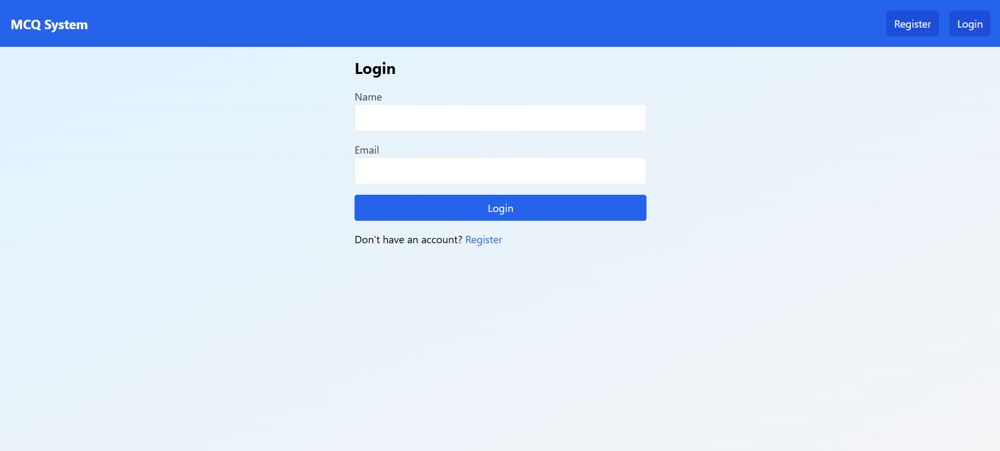
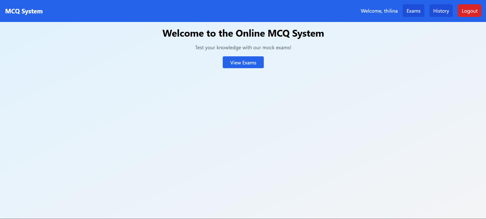
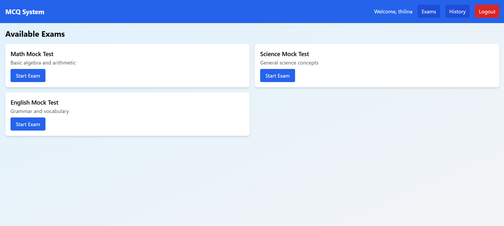
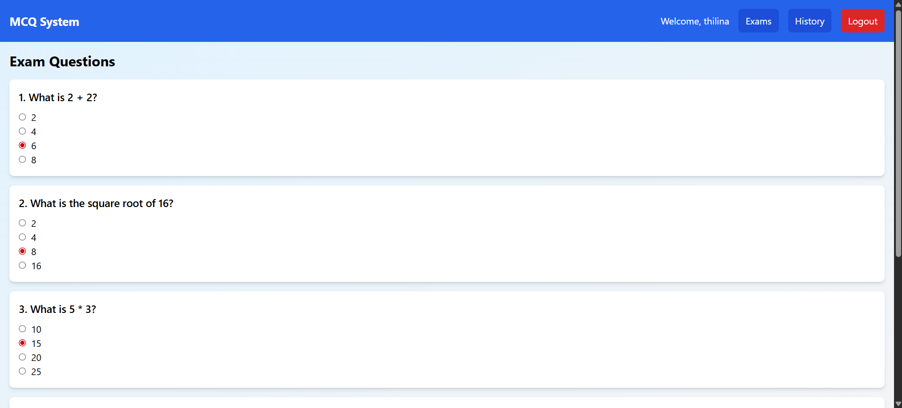
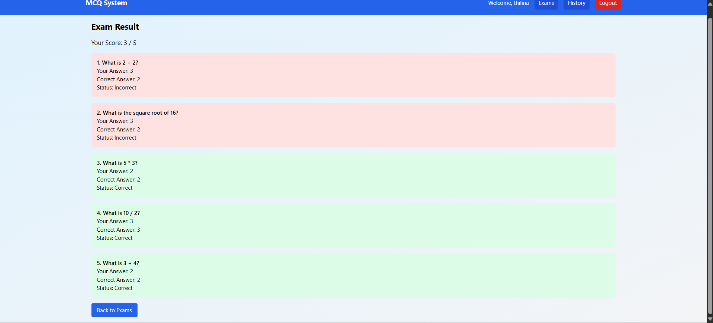

# Online MCQ System - Frontend

## Overview
The frontend of the Online MCQ System is a React application built with Vite, Tailwind CSS, and React Router. It provides a user-friendly interface for users to register, log in, take exams, submit answers, and view their results. The application communicates with the backend via REST APIs and uses JWT for authentication.

## Features
- User registration and login
- Display available exams
- Attempt exams with multiple-choice questions
- Submit answers and view immediate results
- View result history
- Responsive design with Tailwind CSS
- Toast notifications for user feedback

## Prerequisites
- Node.js (v16 or higher)
- npm (Node Package Manager)
- Backend server running (default: `http://localhost:5000`)

## Installation
1. Clone the repository:
   ```bash
   git clone https://github.com/IT22003850/online-mcq-system-frontend.git
   cd online-mcq-system-frontend
   ```

2. Install dependencies:
   ```bash
   npm install
   ```

3. Update the API base URL in `src/config.js` if necessary:
   ```javascript
   export const API_BASE_URL = 'https://online-mcq-system-backend-production.up.railway.app';
   ```

4. Start the development server:
   ```bash
   npm run dev
   ```

5. Build for production:
   ```bash
   npm run build
   ```

6. Preview the production build:
   ```bash
   npm run preview
   ```

## Project Structure
```
online-mcq-system-frontend/
├── src/
│   ├── components/
│   │   ├── ExamCard.jsx        # Component for displaying exam cards
│   │   ├── Navbar.jsx          # Navigation bar component
│   │   ├── Question.jsx        # Component for displaying questions
│   ├── context/
│   │   ├── AuthContext.jsx     # Authentication context for user state
│   ├── pages/
│   │   ├── ExamAttempt.jsx     # Page for attempting exams
│   │   ├── ExamList.jsx        # Page for listing exams
│   │   ├── Home.jsx            # Home page
│   │   ├── Login.jsx           # Login page
│   │   ├── Register.jsx        # Registration page
│   │   ├── Result.jsx          # Result display page
│   │   ├── ResultHistory.jsx   # Result history page
│   ├── App.jsx                 # Main app component with routes
│   ├── config.js               # API base URL configuration
│   ├── index.css              # Tailwind CSS styles
│   ├── main.jsx               # Entry point for React
├── index.html                  # HTML entry point
├── netlify.toml                # Netlify configuration
├── package.json                # Project dependencies and scripts
├── postcss.config.js           # PostCSS configuration
├── tailwind.config.js          # Tailwind CSS configuration
├── vite.config.js              # Vite configuration
```

## Dependencies
- `react`: React library
- `react-dom`: React DOM rendering
- `react-router-dom`: Client-side routing
- `axios`: HTTP client for API requests
- `react-toastify`: Toast notifications
- `@vitejs/plugin-react`: Vite plugin for React
- `tailwindcss`: CSS framework
- `autoprefixer`: CSS vendor prefixing
- `postcss`: CSS post-processing
- `vite`: Build tool

## Scripts
- `npm run dev`: Start development server
- `npm run build`: Build for production
- `npm run preview`: Preview production build

## Deployment
The frontend is deployed on Netlify at `https://online-mcq-system.netlify.app`. The `netlify.toml` file configures redirects to support client-side routing.

## Screenshots


*Login Page*


*Home Interface*


*Exams Interface*


*Questions Interface*


*Results Interface*


*Results History Interface*

## Notes
- The application uses a proxy in development to forward `/api` requests to the backend (default: `http://localhost:5000`).
- Authentication is managed via JWT stored in `localStorage`.
- Ensure the backend server is running and accessible at the URL specified in `src/config.js`.
- Tailwind CSS is used for styling, with configurations in `tailwind.config.js`.